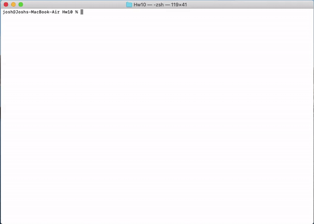

# Employee-Summary


A Software engineering team generator application is created here. It can be invoked using "node app.js" in the command terminal. The application requires the "inquirer" npm package and for testing, it requires the "jest" dependencies. The application will prompt the user for entering information about the team manager and then information about the team members. The user will be prompted to input the team members which consist of engineers and interns. When the user has completed building the team, the application will create a team.html file that displays all the necessary information inputed by the user. An index.html file is added in the output folder as a sample to the team.html file generated by the command line application. The application also passed all the tests provided by running "npm run test" in command line application. 

## Installation
```
npm install
```

## Usage
```
node app.js
```

## Tests
```
npm run test
```

## License
This project is licensed under MIT 

[](https://opensource.org/licenses/MIT)


## Sample Generated HTML
https://joshb4u.github.io/Hw10/output/index.html


## Video Link
https://joshb4u.github.io/Hw10/Assets/Hw10Video.mp4


## Preview (GIF)


